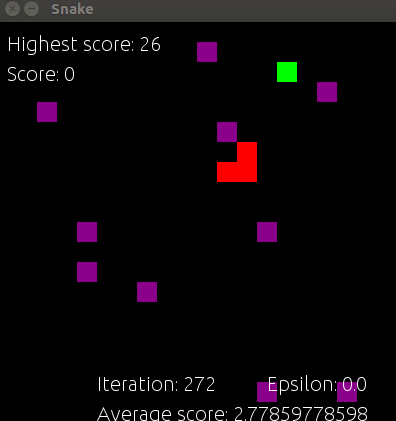
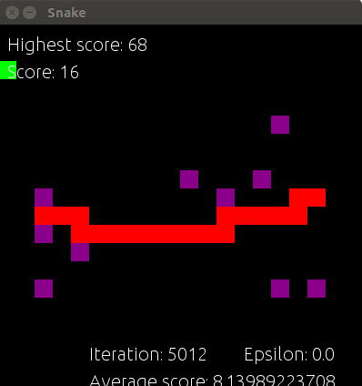

# Reinforcement Learning for Modified Snake Game
Repository for my CS221 (Fall 2018) final project. Written in Python. 

Report: final.pdf

### Prerequisites

Requires pygame.

### Running the agent

To see the agent train, run:

```
$ python main.py
```

Parameters can be tuned in 

```
environment.py
```

and 
```
initialization.py
```

### Training

This is the snake training using Q-Learning with an exploration probability of 0.0:


Slowed down:<br/>

